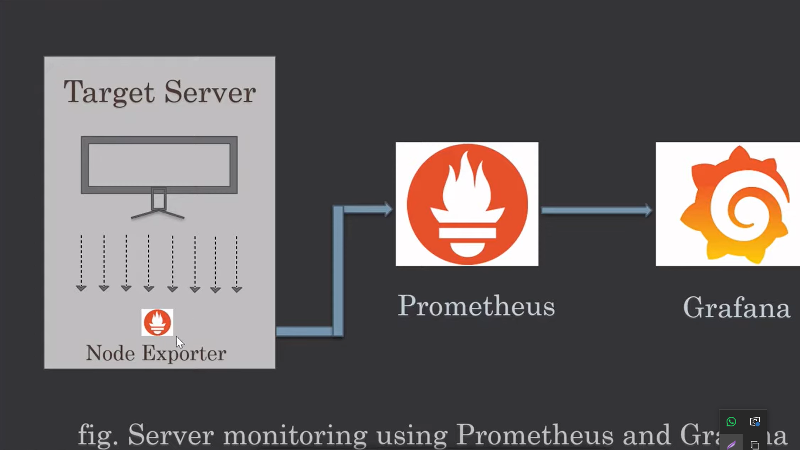

# Prometheus, Grafana and Node Exporter

- **What is Prometheus**
  - Prometheus is an open source linux server monitoring tool mainly used for metrics monitoring, event monitoring, alert management, etc.
  - Prometheus has changed the way of monitoring systems and that is why it has become the Top -Level project of Cloud Native Computing Foundation (CNCF).
  - Prometheus uses a powerful query language i.e. "promQL".
  - In Prometheus tabs handles hundreds of services and microservices.
  - Prometheus use multiple modes used for graphing and dashboard-ing support.

- **Prometheus Configuration file and Components**
  - **prometheus.yml** : It is the configuration file for prometheus where we can do all changes regarding configuration of Prometheus.
  - **Promtool** : It is command-line utility tool is used to verify the configuration of Prometheus.
  - **PromQl** : Prometheus uses its own query language e.x. PromQl which is very powerful querying language.
  - PromQl allows the user to select and aggregate the data.
  - 9090 port for Prometheus

- **What is Grafana**
  - Grafana is a free and open source visualization tool mostly used with Prometheus to which monitor metrics.
  - Grafana provides various dashboards, charts, graphs, alerts for the particular data source.
  - Grafana allows us to query, visualize, explore metrics and set alerts for the data source which can be a system, server, nodes, cluster, etc.
  - 3000 port for grafana

- **What is Node Exporter**
  - Node exporter is one of the Prometheus exports which is used to expose servers or system Os metrics
  - With the help of node exporter we can expose various resources of the system like RAM, CPU utilization, Memory Utilization, disk space.
  - Node exporter runs as a system service which gathers the metrics of your system and that gathered metrics is displayed with the help of Grafana visualization tool.
  - 9100 port for grafana



- **Install Prometheus in Linux**

```
#!/bin/bash

set -e

echo "🔄 Updating system..."
sudo yum update -y

echo "👤 Creating Prometheus user..."
sudo useradd --no-create-home --shell /bin/false prometheus || true

echo "⬇️ Downloading Prometheus..."
cd /tmp
wget https://github.com/prometheus/prometheus/releases/download/v3.11.2/prometheus-3.11.2.linux-amd64.tar.gz

echo "📦 Extracting..."
tar -xvf prometheus-3.11.2.linux-amd64.tar.gz
cd prometheus-3.11.2.linux-amd64

echo "🚚 Moving binaries..."
sudo cp prometheus /usr/local/bin/
sudo cp promtool /usr/local/bin/

echo "📁 Creating directories..."
sudo mkdir -p /etc/prometheus
sudo mkdir -p /var/lib/prometheus

echo "⚙️ Copying configuration..."
sudo cp prometheus.yml /etc/prometheus/

echo "🔐 Setting permissions..."
sudo chown -R prometheus:prometheus /etc/prometheus
sudo chown -R prometheus:prometheus /var/lib/prometheus

echo "🧩 Creating systemd service..."
sudo tee /etc/systemd/system/prometheus.service > /dev/null <<EOF
[Unit]
Description=Prometheus
Wants=network-online.target
After=network-online.target

[Service]
User=prometheus
ExecStart=/usr/local/bin/prometheus \
  --config.file=/etc/prometheus/prometheus.yml \
  --storage.tsdb.path=/var/lib/prometheus

Restart=always

[Install]
WantedBy=multi-user.target
EOF

echo "🚀 Starting Prometheus..."
sudo systemctl daemon-reexec
sudo systemctl daemon-reload
sudo systemctl start prometheus
sudo systemctl enable prometheus

echo "✅ Checking status..."
sudo systemctl status prometheus --no-pager

echo ""
echo "🌐 Access Prometheus at: http://<YOUR_EC2_PUBLIC_IP>:9090"
echo "⚠️ Make sure port 9090 is open in Security Group"

```
